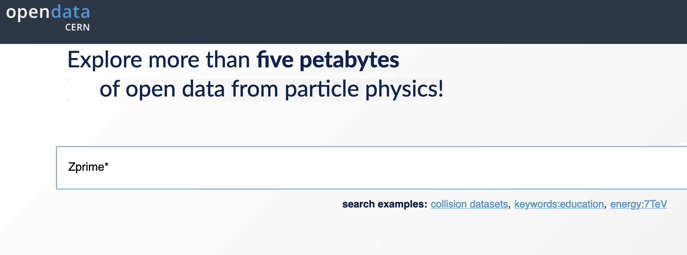
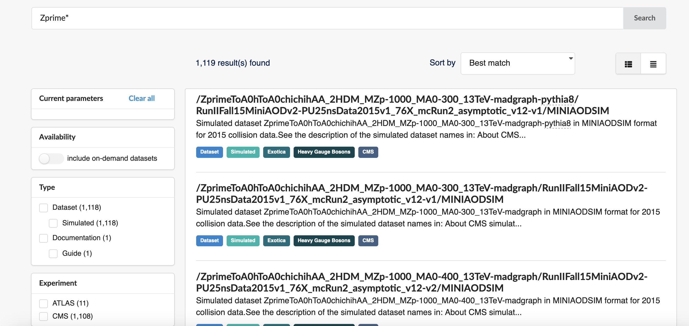
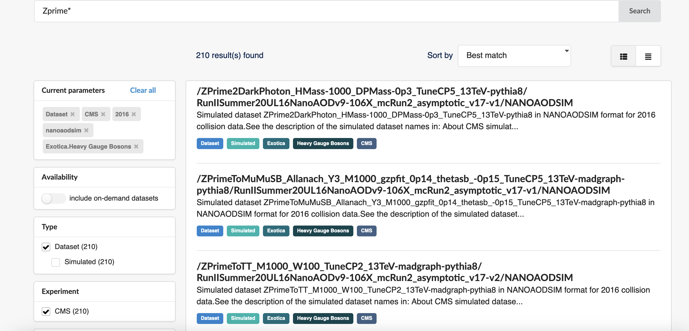
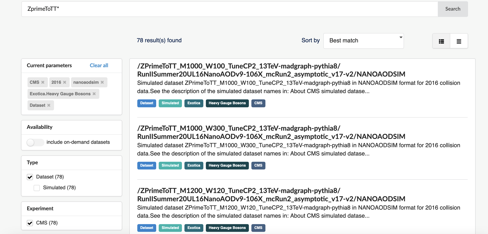

:::::::::::::::::::::::::::::::::::::: questions 

- How do we find a specific nanoAOD dataset on the CERN Open Data Portal?
- How do we use `cernopendata-client` to get file locations for a dataset?
- How do we explore the content of a nanoAOD simulation file?

::::::::::::::::::::::::::::::::::::::::::::::::

::::::::::::::::::::::::::::::::::::: objectives

- Find a specific NANOAOD simulation dataset using the CERN Open Data Portal search tools
- Use `cernopendata-client` to retrieve file locations for a chosen dataset
- Inspect the content of a NANOAOD file using python tools

::::::::::::::::::::::::::::::::::::::::::::::::

## Find and explore a nanoAOD dataset

Now that you know how to navigate the CERN Open Data Portal, use
`cernopendata-client`, and know a bit about NANOAOD format, let's apply those 
skills together in a concrete example.
We'll find and explore simulated Z' events in which the Z' decays to a
top and antitop quark pair — a dataset we will use throughout the workshop.

:::::: callout
A Z' ("Z-prime") is a hypothetical heavy gauge boson that could arise from
extensions of the Standard Model. A review of searches for the Z' 
can be found [here](https://pdg.lbl.gov/2024/reviews/rpp2024-rev-zprime-searches.pdf).
::::::

### Find the dataset

All data can be found via the [CERN Open Data Portal](https://opendata.cern.ch).
Let's search for simulated Z' datasets. Dataset naming in CMS can seem obscure,
but we can start with a broad wildcard search for `Zprime*`:

{alt='Search for Zprime* at the CODP'}

The query returns [over 1000 records](https://opendata.cern.ch/search?q=Zprime%2A&l=list&order=asc&p=1&s=10&sort=bestmatch):

{alt='Search results for Zprime*'}

We can narrow the results by selecting **Type: Dataset**, **Experiment: CMS**,
**Year: 2016**, **File type: nanoaodsim**, and **Category: Heavy Gauge Bosons**.
This reduces the [matches](https://opendata.cern.ch/search?q=Zprime%2A&f=experiment%3ACMS&f=year%3A2016&f=file_type%3Ananoaodsim&f=category%3AExotica%2Bsubcategory%3AHeavy%20Gauge%20Bosons&f=type%3ADataset&l=list&order=asc&p=1&s=10&sort=bestmatch)
from over 1000 down to around 210:

{alt='Narrowed search results for Zprime*'}

We can now read the dataset names more easily: "Zprime" is the particle
produced, followed by its decay products. We want $Z^{'} \rightarrow t\bar{t}$,
which appears as "ZprimeToTT". Let's [narrow further](https://opendata.cern.ch/search?q=ZprimeToTT%2A&f=experiment%3ACMS&f=year%3A2016&f=file_type%3Ananoaodsim&f=category%3AExotica%2Bsubcategory%3AHeavy%20Gauge%20Bosons&f=type%3ADataset&l=list&order=asc&p=1&s=10&sort=bestmatch):

{alt='Narrowed search results for ZprimeToTT*'}

### Dataset naming

The dataset names encode several pieces of information:

- **ZPrimeToTT** — the particle produced and its decay ($Z' \rightarrow t\bar{t}$)
- **M1000** — the mass (in GeV) of the hypothetical Z' (here, 1000 GeV)
- **W100** — the width of the Z' resonance (here, 100 GeV)
- **TuneCP2** — the underlying-event tune used in PYTHIA8
- **13TeV** — the center-of-mass energy of the collision
- **madgraph-pythia8** — the event generators used (MadGraph for the hard process,
  PYTHIA8 for hadronization)

Several mass points are available in these results, spanning from 500 GeV to
several TeV. The choice of mass point is part of your physics analysis strategy.

## Exercises

::::::::::::::::::::::::::::::::::::: challenge 

## Exercise 1: Get data file locations

Choose a ZprimeToTT sample for a given mass and use `cernopendata-client`
to retrieve the associated data file locations.

Recall what you've learned about `cernopendata-client` from
[Episode 4](04-cli-through-cernopendata-client.md).

:::::::::::::::::::::::: solution 

## Solution

Search for ZprimeToTT samples in the CERN Open Data Portal using the
filters above. The resulting query is [here](https://opendata.cern.ch/search?q=ZprimeToTT%2A&f=experiment%3ACMS&f=year%3A2016&f=file_type%3Ananoaodsim&f=category%3AExotica%2Bsubcategory%3AHeavy%20Gauge%20Bosons&f=type%3ADataset&l=list&order=asc&p=1&s=10&sort=bestmatch).

Select a dataset. Here we use [record 75124](https://opendata.cern.ch/record/75124),
"Simulated dataset ZPrimeToTT_M1000_W100_TuneCP2_13TeV-madgraph-pythia8 in
NANOAODSIM format for 2016 collision data" (Z' mass = 1000 GeV).

Confirm the available commands:

```bash
cernopendata-client --help
```

```output
Usage: cernopendata-client [OPTIONS] COMMAND [ARGS]...

  Command-line client for interacting with CERN Open Data portal.

Options:
  --help  Show this message and exit.

Commands:
  download-files      Download data files belonging to a record.
  get-file-locations  Get a list of data file locations of a record.
  get-metadata        Get metadata content of a record.
  list-directory      List contents of a EOSPUBLIC Open Data directory.
  verify-files        Verify downloaded data file integrity.
  version             Return cernopendata-client version.
```

Fetch the file locations for record 75124:

```bash
cernopendata-client get-file-locations --recid 75124
```

```output
http://opendata.cern.ch/eos/opendata/cms/mc/RunIISummer20UL16NanoAODv9/ZPrimeToTT_M1000_W100_TuneCP2_13TeV-madgraph-pythia8/NANOAODSIM/106X_mcRun2_asymptotic_v17-v2/2520000/65A0736B-22F3-C94C-99AE-36717B28629C.root
http://opendata.cern.ch/eos/opendata/cms/mc/RunIISummer20UL16NanoAODv9/ZPrimeToTT_M1000_W100_TuneCP2_13TeV-madgraph-pythia8/NANOAODSIM/106X_mcRun2_asymptotic_v17-v2/2520000/6E508763-A12F-8846-A295-F39EE7DDAA52.root
http://opendata.cern.ch/eos/opendata/cms/mc/RunIISummer20UL16NanoAODv9/ZPrimeToTT_M1000_W100_TuneCP2_13TeV-madgraph-pythia8/NANOAODSIM/106X_mcRun2_asymptotic_v17-v2/2530000/7B2D5CD5-9CAE-C046-A9AB-50CE9D48B187.root
http://opendata.cern.ch/eos/opendata/cms/mc/RunIISummer20UL16NanoAODv9/ZPrimeToTT_M1000_W100_TuneCP2_13TeV-madgraph-pythia8/NANOAODSIM/106X_mcRun2_asymptotic_v17-v2/260000/1A50245D-8213-6340-8EA0-CB064EEC6AF3.root
http://opendata.cern.ch/eos/opendata/cms/mc/RunIISummer20UL16NanoAODv9/ZPrimeToTT_M1000_W100_TuneCP2_13TeV-madgraph-pythia8/NANOAODSIM/106X_mcRun2_asymptotic_v17-v2/270000/09FA6C37-21D6-7846-B3E1-F8086CBA0E9E.root
http://opendata.cern.ch/eos/opendata/cms/mc/RunIISummer20UL16NanoAODv9/ZPrimeToTT_M1000_W100_TuneCP2_13TeV-madgraph-pythia8/NANOAODSIM/106X_mcRun2_asymptotic_v17-v2/270000/3AAB5B1E-7169-9C4D-841C-CB2D6E40CBAE.root
http://opendata.cern.ch/eos/opendata/cms/mc/RunIISummer20UL16NanoAODv9/ZPrimeToTT_M1000_W100_TuneCP2_13TeV-madgraph-pythia8/NANOAODSIM/106X_mcRun2_asymptotic_v17-v2/270000/820C3EBC-0E1D-CE41-9418-FA1615123FC2.root
http://opendata.cern.ch/eos/opendata/cms/mc/RunIISummer20UL16NanoAODv9/ZPrimeToTT_M1000_W100_TuneCP2_13TeV-madgraph-pythia8/NANOAODSIM/106X_mcRun2_asymptotic_v17-v2/270000/CF54D079-349C-FB4F-B6E5-3D579D89EDE4.root
http://opendata.cern.ch/eos/opendata/cms/mc/RunIISummer20UL16NanoAODv9/ZPrimeToTT_M1000_W100_TuneCP2_13TeV-madgraph-pythia8/NANOAODSIM/106X_mcRun2_asymptotic_v17-v2/80000/E964C281-43FB-D349-A436-9A3FDA0BAA28.root
```

To save these to a file for use in later analysis steps:

```bash
cernopendata-client get-file-locations --recid 75124 --protocol xrootd > files-recid-75124.txt
```

:::::::::::::::::::::::::::::::::

::::::::::::::::::::::::::::::::::::::::::::::::

::::::::::::::::::::::::::::::::::::: challenge 

## Exercise 2: Inspect the data file

Using the file locations from Exercise 1 and the python tools you learned
about in [Episode 5](05-what-is-in-the-data.md), open one of the Z' simulation
files and explore its contents. Launch Jupyter Lab:

```bash
jupyter-lab
```

What variables are available? How does the jet content compare to what you
saw in the SingleMuon collision data file?

:::::::::::::::::::::::: solution 

## Solution

Import the necessary libraries in a notebook cell:

```python
import uproot
import matplotlib.pylab as plt
import awkward as ak
import numpy as np
```

Open one of the Z' files using the XRootD path:

```python
file = uproot.open("http://opendata.cern.ch/eos/opendata/cms/mc/RunIISummer20UL16NanoAODv9/ZPrimeToTT_M1000_W100_TuneCP2_13TeV-madgraph-pythia8/NANOAODSIM/106X_mcRun2_asymptotic_v17-v2/2520000/65A0736B-22F3-C94C-99AE-36717B28629C.root")
```

Check the top-level content blocks:

```python
file.classnames()
```

```output
{'tag;1': 'TObjString',
 'Events;1': 'TTree',
 'LuminosityBlocks;1': 'TTree',
 'Runs;1': 'TTree',
 'MetaData;1': 'TTree',
 'ParameterSets;1': 'TTree'}
```

Get the Events tree and list its variables:

```python
events = file['Events']
events.keys()
```

You will see the same variable structure as in the collision data, but
with additional Monte Carlo fields such as `GenPart_*` (generator-level
particles) and `genWeight`. Because this is a $Z' \rightarrow t\bar{t}$
sample, the events contain many jets from the top quark decays. Fetch
the AK4 jet transverse momentum:

```python
jet_pt = events['Jet_pt'].array()
```

Plot the distribution:

```python
plt.hist(ak.flatten(jet_pt), bins=100, range=(0, 500))
plt.xlabel('Jet $p_T$ [GeV]')
plt.ylabel('Entries')
plt.title('AK4 jet $p_T$ — ZPrimeToTT M1000')
plt.show()
```

Compare the number of jets per event to what you saw in the SingleMuon data:

```python
import numpy as np
print(f"Mean jets per event: {np.mean(ak.num(jet_pt)):.1f}")
```

You should observe a higher jet multiplicity here than in a typical
collision data event, consistent with the two top quarks each decaying
to a W boson and a b quark, with the W bosons decaying further.

To see the generator-level top quarks, look at the `GenPart_*` variables.
For example, inspect the PDG IDs of the generated particles:

```python
genpart_pdgid = events['GenPart_pdgId'].array()
print(genpart_pdgid[:3])
```

A PDG ID of 6 corresponds to a top quark and -6 to an antitop quark.

:::::::::::::::::::::::::::::::::

::::::::::::::::::::::::::::::::::::::::::::::::

::::::::::::::::::::::::::::::::::::: keypoints 

- Use the CERN Open Data Portal search filters (experiment, year, file type, category) to efficiently locate specific simulation datasets.
- Dataset names encode the physics process, particle mass and width, collision energy, and generator software.
- `cernopendata-client` retrieves file locations programmatically, making it easy to script dataset access.
- NANOAODSIM files contain the same reconstructed-object variables as collision NANOAOD files, plus generator-level information such as `GenPart_*` and `genWeight`.

::::::::::::::::::::::::::::::::::::::::::::::::
